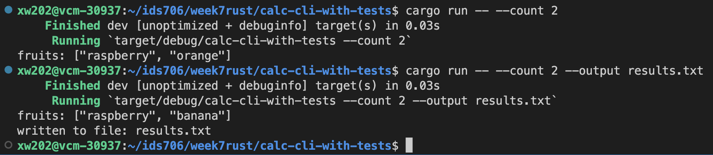
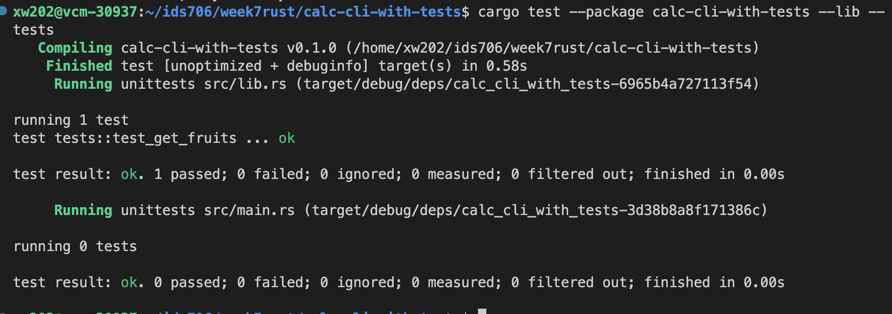

[](https://github.com/nogibjj/rust-data-engineering/actions/workflows/lint.yml)
[](https://github.com/nogibjj/rust-data-engineering/actions/workflows/tests.yml)


# Rust Data Engineering
### week7 a Rust Command-Line Tool
In this project I create a rust command-line tool that can choose random fruits and print to terminal or a file.

## Sample Output



### Technical Notes

## Makefile

Each subdirectory project uses this style to make it easy to test and run

```
format:
	cargo fmt --quiet

lint:
	cargo clippy --quiet

test:
	cargo test --quiet

run:
	cargo run 

all: format lint test run
```


## References

* [Rust Collections](https://doc.rust-lang.org/std/collections/index.html)
* [GitHub Copilot CLI](https://www.npmjs.com/package/@githubnext/github-copilot-cli)
* [Rust Fundamentals](https://github.com/alfredodeza/rust-fundamentals)
* [Rust Tutorial](https://nogibjj.github.io/rust-tutorial/)
* [Rust MLOps Template](https://github.com/nogibjj/mlops-template)
